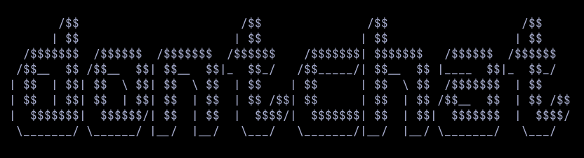

# dontchat alpha0.1 (prototype)


Create a private chat over dontpad.
Current language: PT-BR

Bear in mind this version is barely functional. The chat currently only updates as long as there is chat interaction. This will be corrected when curses is implemented, allowing it to work as a proper chat client. If you want to add this functionality yourself, be my guest. :)

* Made for GNU/Linux environments.
* This client currently uses your environment USER variable
as your username for the chat.
* The chatroom name is converted to its MD5 hash and is used as the chatroom URL (obscurity)

# usage
```
git clone https://github.com/theocampelo/dontchat
cd dontchat
chmod +x main.py
./main.py
```
# TODO
* Implement curses (to clear screen and receive input simultaneously)
* Implement server-side cryptography (RSA keypair or similar? TBD)
* Decrypt messages client-side with a key
* Tidy up spaghetti code

(Incombiner 2023)
